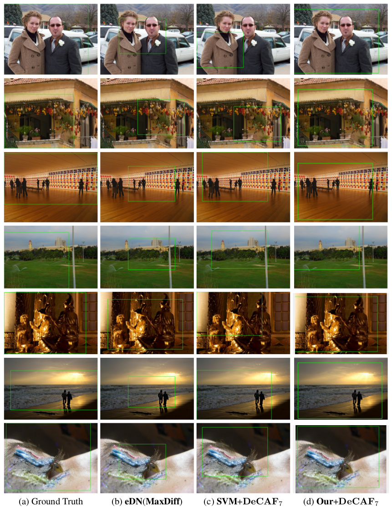

### Brief Introduction

Automatic photo cropping is an important tool for improving visual quality of digital photos without resorting to tedious manual selection. Traditionally, photo cropping is accomplished by determining the best proposal window through visual quality assessment or saliency detection. In essence, the performance of an image cropper highly depends on the ability to correctly rank a number of visually similar proposal windows. Despite the ranking nature of automatic photo cropping, little attention has been paid to **learning-to-rank** algorithms in tackling such a problem. In this work, we conduct an extensive study on traditional approaches as well as ranking-based croppers trained on various image features. In addition, a new dataset consisting of high quality cropping and pairwise ranking annotations is presented to evaluate the performance of various baselines. The experimental results on the new dataset provide useful insights into the design of better photo cropping algorithms.

### Dataset

The final dataset is composed of 3,413 images on Flickr with Creative Commons License.

> **Note:** Run `scripts/download_ranking_images` to automatically download the images from Flickr.

There are two types of annotations in this dataset: **cropping** and **ranking**.

1. Cropping: `cropping_training_set.json` and `cropping_testing_set.json` contain the cropping annotations of this dataset. The annotations are saved as an array of JSON dictionaries. Each dictionary includes the information of one image. See the following for an example.
```json
[
    {
        "url":"https://farm5.staticflickr.com/4096/4910188666_04cf9f487d_b.jpg",
        "flickr_photo_id":4910188666,
        "crop":[
            266,
            6,
            757,
            399
        ]
    },
]
```
2. Ranking: `ranking_annotation.json` contain the ranking annotations of this dataset. The annotations are saved as an array of JSON dictionaries. Each dictionary includes the information of one image. Each image contains ten crop pairs. The crop with more votes is more visually pleasing than the other one. See the following for an example.
```json
[
    {
        "url":"https://farm3.staticflickr.com/2946/15251367120_9bdca6b5c3_c.jpg",
        "crops":[
            {
                "vote_for_1":1,
                "vote_for_0":4,
                "crop_1":[
                    171,
                    281,
                    300,
                    400
                ],
                "crop_0":[
                    139,
                    234,
                    300,
                    400
                ]
            },
        ],
        "flickr_photo_id":15251367120
    },
]
```
### Results

The following figures demonstrates several examples of comparing the ground truth and the best crop windows determined by various methods.


### Paper

**If you use this dataset in an academic paper, please consider to cite:**

    @inproceedings{chen-wacv2017,
      title={Quantitative Analysis of Automatic Image Cropping Algorithms:A Dataset and Comparative Study},
      author={Yi-Ling Chen and Tzu-Wei Huang and Kai-Han Chang and Yu-Chen Tsai and Hwann-Tzong Chen and Bing-Yu Chen},
      booktitle={WACV 2017},
      year={2017}
    }

### Support or Contact
If you have questions/suggestions, feel free to send an email to (yiling dot chen dot ntu at gmail dot com).
